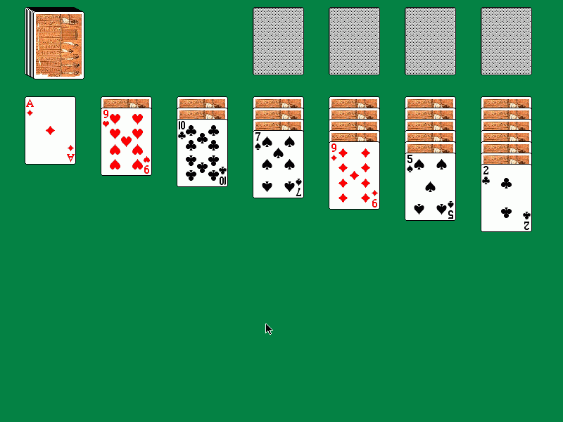
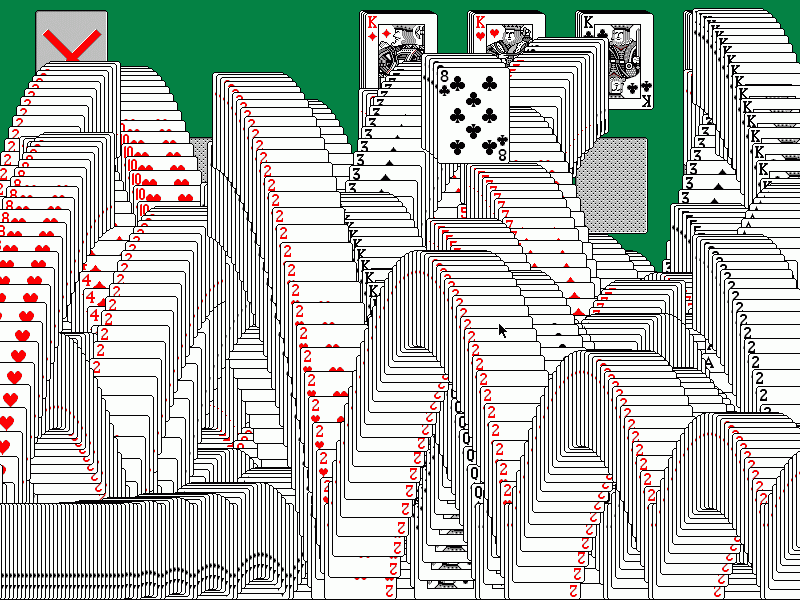

# Drac

Drac is a free, open-source, portable card game library that uses [SDL](http://libsdl.org/). It provides a good set of C++ classes and functions that help simplify the development of card games. Simple games especially solitaire games can be created using Drac with minimal effort. It can also be extended to accommodate more complex games such as [Tongits](https://github.com/ricoz/tongits/).

## Features

* Card drag and drop. Drac supports four types of dragging. You'll get to know them once you start using Drac in your card game projects. Drag and drop in Drac can be as simple as setting flags that determine how a certain area accepts cards that are being dropped.
* Uses data structures to represent cards and card collections. Cards, card stacks, and card regions, including the game itself, are represented by classes. This simplifies development since you only need to define the regions your game requires then configure those regions based on the rules of the game.
* Includes utility functions for getting card information such as card rank, suit, value, etc. Also includes functions for detecting overlapped cards and determining which card to accept based on the size of the area that overlaps.
* A sample game, the famous Klondike is included to demonstrate how to use Drac. The actual game only requires a few lines of code, Drac takes care of the rest. [This brief tutorial](https://github.com/ricoz/drac/blob/master/klondike-tutorial.md) will explain how Klondike was made using Drac.
* Includes a simple animation that you can use when a player wins similar to the one in Solitaire for Windows.
* Portable. Has been proven to run on [Nokia Maemo platform](http://maemo.org/downloads/product/OS2008/maemodrac/) (now part of MeeGo), [Sega Dreamcast](http://www.dcemu.co.uk/vbulletin/threads/221403-KlondikeDC), [Popcorn Hour](http://www.networkedmediatank.com/showthread.php?tid=39054), ~~[BeOS](http://www.bebits.com/app/3799)~~ and ~~[Haiku](http://haikuware.com/directory/view-details/games/cards/tong-its)~~.

## Screenshots

 

## Credits

* ~~Bitmap Font by [Marius](http://cone3d.gamedev.net/)~~ (old dead link)
* [James Brown](http://www.catch22.net/) for his help and for his great program [CardLib](http://www.catch22.net/tuts/cardlib) which inspired this project.
* [Oxymoron for the card images used](http://www.waste.org/~oxymoron/cards/)
* ~~[Stephen Murphy's](http://www.telusplanet.net/public/stevem/) QCard32.dll for the card symbols used.~~ (old dead link)
